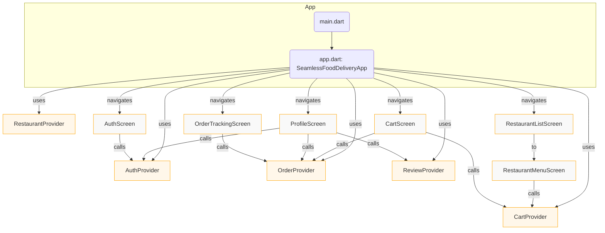

# Seamless Food Delivery: Mobile Frontend  
*Comprehensive Documentation of Architecture, Features, and Code Structure*

---

## Overview

The `mobile_frontend` container is a user-facing mobile application, developed in Flutter, that allows users to browse local restaurants, view menus, order food, track deliveries, and leave reviews. As part of the Seamless Food Delivery platform, this container interacts with backend APIs to provide a smooth, modern, and minimalistic user experience. The application connects customers to restaurants and delivery personnel for rapid and seamless food delivery.

---

## Product Requirements and Features

### Core Features

- **User Authentication and Registration:**  
  Users can register and log in through a single unified screen supporting both operations. State is managed securely with in-memory and (potentially) persisted tokens.

- **Browse Restaurants and Menus:**  
  Users are presented with a browsable list of restaurants. For each restaurant, viewing its full menu is supported with images and descriptions for each menu item.

- **Cart and Order Placement:**  
  Items may be added to a user’s cart from restaurant menus. The cart screen allows for quantity adjustments and removing items. Users can place an order by submitting the cart.

- **Payment Integration (Planned):**  
  The codebase is structured to support future payment integration as part of the order flow.

- **Order Tracking:**  
  Placed orders are tracked through a dedicated tracking screen, showing live status updates and a mock delivery progress visualization.

- **Order History and Reviews:**  
  Users can view their history of completed orders in their profile. Each order allows adding a review for the associated restaurant.

### User Experience and Visual Style

- Modern, clean, and minimalistic design principles
- Consistent color scheme using orange primary and accent highlights
- Bottom navigation bar for main screen navigation
- Cards and lists for item and restaurant browsing

---

## Architecture

The mobile frontend is organized according to the following architectural principles:

- **Provider-Based State Management:**  
  Core app state (authentication, cart, restaurant listings, order status, and reviews) is provided using the `provider` package through ChangeNotifier classes.

- **Layered Directory Structure:**  
  - `models/` holds data structures and entities.
  - `providers/` contains business logic, state management, and API hooks for future integration.
  - `screens/` implements visual widgets, with further sub-packaging by functional domain.
  - `theme.dart` defines the unified look and feel.
  - The entry point (`main.dart`) loads environment configuration and initializes top-level state management.
  - Routing and persistent navigation are managed in `app.dart`.

- **API Integration Point:**  
  API endpoints are abstracted for future backend connection. The current code uses mock data, but clearly marks points for integration.

- **Platform Adaptation:**  
  Android-specific launch files and Gradle build scripts enable native builds. All UI logic is implemented in Flutter for cross-platform support.

---

## Codebase Structure

```
lib/
 ├── main.dart                # App entry point, initializes providers
 ├── src/
 │   ├── app.dart                 # App configuration, routing, nav bar, theme
 │   ├── theme.dart               # Theme definition (colors, fonts, component styles)
 │   ├── models/                  # Data models: Restaurant, MenuItem, CartItem, Order, Review
 │   ├── providers/               # State logic: Auth, Cart, Order, Restaurant, Review
 │   └── screens/                 # Screens by feature:
 │       ├── auth/                    # Authentication UI
 │       ├── restaurant/              # Restaurant list and menu views
 │       ├── cart/                    # Cart and order placement
 │       ├── order/                   # Order tracking UI
 │       └── profile/                 # User profile & order history
 └── ...
```

---

## Key Modules and Data Flow

### Models

- **Restaurant**: id, name, description, imageUrl
- **MenuItem**: id, restaurantId, name, description, price, imageUrl
- **CartItem**: menuItem, quantity
- **Order**: id, status, items, placedAt, deliveryLocation, restaurantName
- **Review**: restaurantId, userId, rating, comment

### Providers

- **AuthProvider**:  
  Handles login, registration, authentication status, and manages user identity.

- **RestaurantProvider**:  
  Fetches restaurant lists and menus, maintains state per restaurant.

- **CartProvider**:  
  Manages the current cart, item addition/removal, and computes the total price.

- **OrderProvider**:  
  Handles placing new orders, tracking live/current order status, and fetching order history.

- **ReviewProvider**:  
  Adds and fetches user-submitted reviews for ordering feedback.

### Screens/Widgets

- **AuthScreen:**  
  Unified login and registration from a responsive form.

- **RestaurantListScreen:**  
  Scrollable list of all restaurants, navigates to restaurant menus.

- **RestaurantMenuScreen:**  
  Displays individual restaurant menu, allows adding menu items to cart.

- **CartScreen:**  
  Lists cart content, enables order placement.

- **OrderTrackingScreen:**  
  Shows live order status and a stylized progress/mock map.

- **ProfileScreen:**  
  View order history and user info, submit reviews for completed orders.

---

## Theming and Appearance

The app applies a cohesive visual style using a custom light theme:

- **Primary color:** orange (`#FFA500`)
- **Accent color:** orange-red (`#FF4500`)
- **Background:** white
- **Navigation bar background:** off-white (`#F9F9F9`)
- **Font:** Roboto

These are centrally configured in `src/theme.dart`.

---

## High-Level Architecture Diagram



---

## Technical Stack

- **Flutter** (Dart) for cross-platform UI development
- **provider** for state management
- **shared_preferences, sqflite, flutter_dotenv** as utility/plugins
- **Material UI** components for native look and feel

Dependencies and asset entries are defined in `pubspec.yaml`.

---

## Extensibility

- The project is structured to support feature expansion, including payment gateway integration, advanced order tracking with actual live maps, richer user profiles, and persistent data storage using backend APIs.
- Modularized code promotes easy testing and maintainability.

---

## Build and Platform Notes

- The application can be built directly for Android using Gradle scripts in `android/`.
- Material icons and UI adapt seamlessly to iOS and Android.
- Environment variables can be injected via `.env` loaded at startup.

---

## Conclusion

The mobile_frontend container of Seamless Food Delivery provides a robust foundation for user interaction in a multi-actor food delivery platform. With extensibility, testability, and modern design at its heart, it is well-suited for rapid iteration and future enhancements.

---

**Sources:**  
- pubspec.yaml (dependencies, assets, versioning)  
- lib/main.dart (entry point, providers)  
- lib/src/app.dart (routing, navigation, theme, structure)  
- lib/src/theme.dart (styling, colors)  
- lib/src/models/* (data models)  
- lib/src/providers/* (app logic/state)  
- lib/src/screens/* (UI components)
